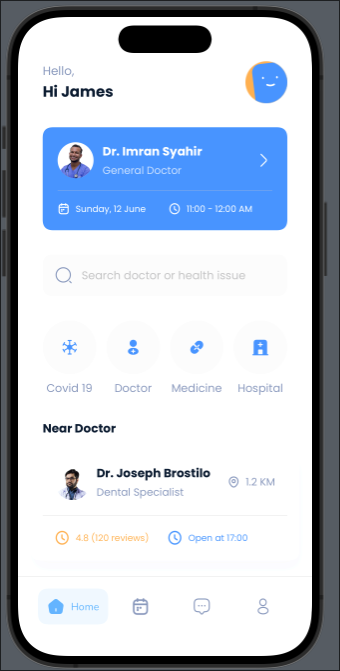
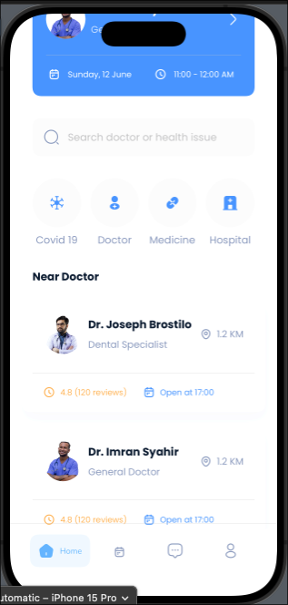
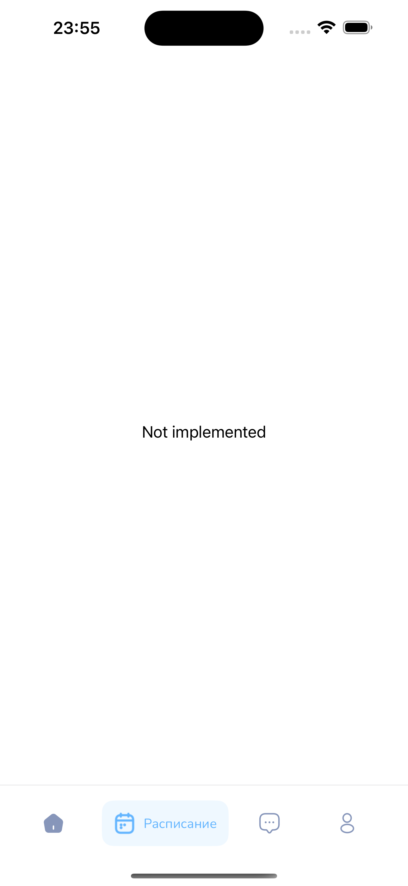
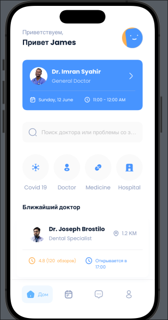

# 2 lab work / iOS + SwiftUI
Note: the card in the 'near doctor' section in russian localization is too big and it take 2 lines and I'm think that it's a design flaw.

Couldn't test accessibility because vm has no sound.

# Screenshots

# How to start
~~1. Buy MacBook~~
1. Clone this repository(from XCode or command line

And you are ready to go!
